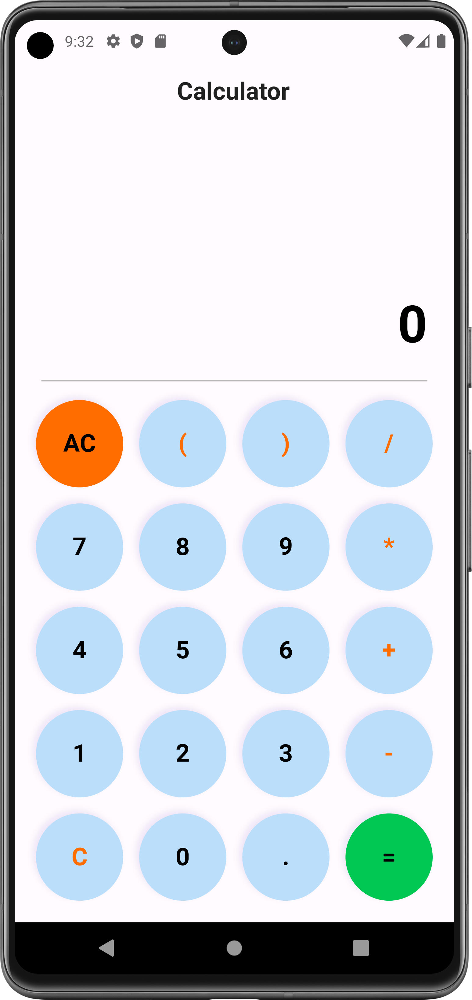
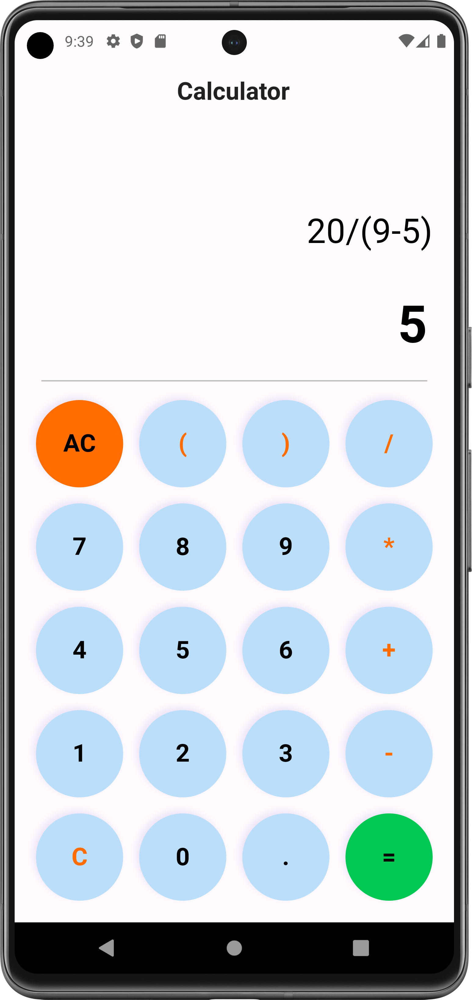
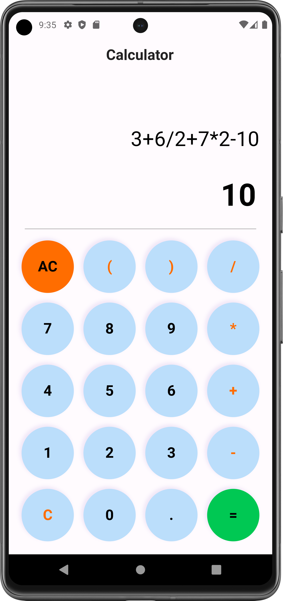

# calculator_app

Flutter project: Calculator App Development

### About Project:

This is a simple Calculator App to perform basic operatio like: +,/,-,*

Here keyboard is created by using of Widgets like: GridView,InkWell..etc 

To learn more about Widgets:
- [flutter.dev](https://docs.flutter.dev/get-started/codelab)

### Some Screenshots:

<table>
  <tr>
    <td></td>
    <td></td>
    <td></td>
  </tr>
 </table>
